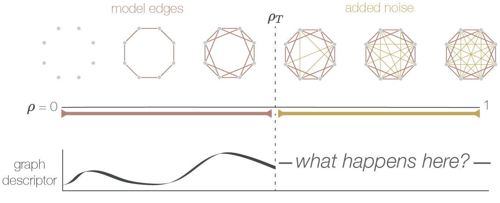

# Supplementary [visualizations](https://asizemore.github.io/noise_and_tda_supplement/) of results for "Variability in higher order structure of noise added to weighted networks" 
### Blevins, Kim, and Bassett. (arxiv 2021)

------

## Helpful links
- Interactive visualization [site](https://asizemore.github.io/noise_and_tda_supplement/).
- Main paper arxiv [link](https://arxiv.org/pdf/2101.03933.pdf).
- [Repository](https://github.com/asizemore/Noise_and_TDA) for the main calculations.

---

The code within this repository displays interactive plots to accompany the results provided within the main paper. For descriptions of the experiments and data, please visit the [main repository](https://github.com/asizemore/Noise_and_TDA) or paper.